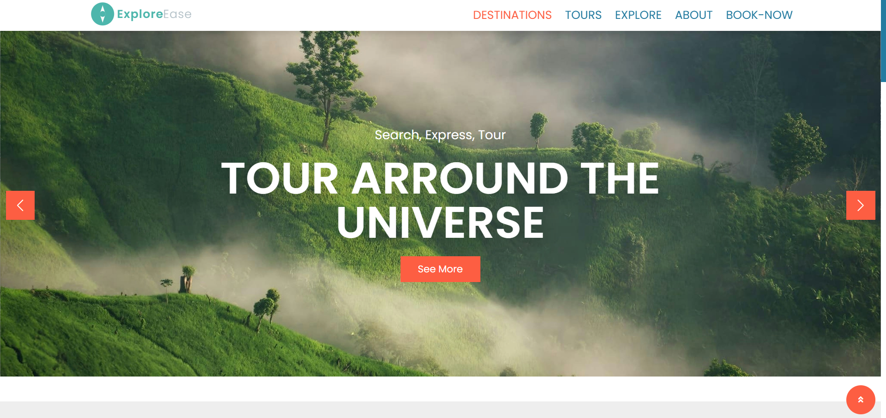
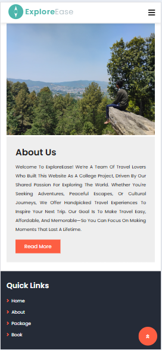
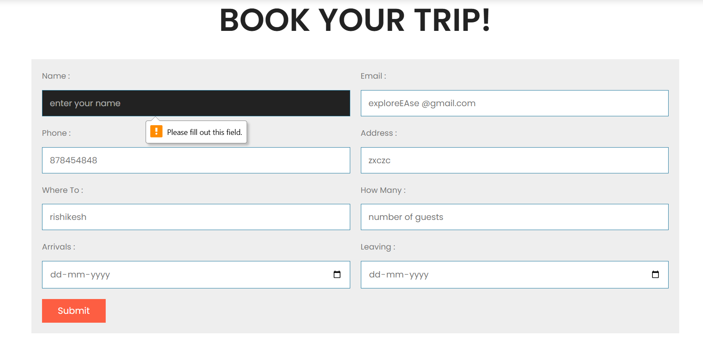
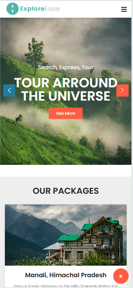

# 🌍 ExploreEase – Tour & Travel Website Frontend

ExploreEase is a front-end travel website developed by a group of software engineering students as part of a college project. Designed with passion for travel, the platform helps users discover top destinations, book tours, and explore underrated gems across India and beyond.

## ✨ Features

- 🧭 Beautiful homepage with curated travel destinations
- 📦 Dedicated tour packages (India & International)
- 🧳 Underrated destination highlights
- 📘 About Us page with our story and project intent
- 📅 Book Now form for easy planning
- 📱 Fully responsive layout
- 🎨 Modern UI with custom illustrations and images

## 📁 Tech Stack

- **HTML5** – Structure
- **CSS3** – Styling & Animations
- **JavaScript / jQuery** – Dynamic interactions
- **Swiper.js** – Responsive carousels
- **Font Awesome** – Icons
- **Google Fonts** – Typography

## 📷 Screenshots

### 🏠Home page


### 📅Tours


### 🔤About Us


### 📅Booking page


### 📅mobile view Page


## 🚀 How to Run

1. Clone this repository:
   ```bash
   git clone https://github.com/harshsinghpujari/ExploreEase-Tour-Travel_Project.git

##🙋🏻‍♂️Author
Himanshu Singh  
[Github profile link ] https://github.com/harshsinghpujari
